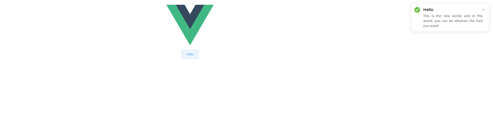

# Hello new world

## 创建项目

* 下载[Vue-Element UI项目模板](https://github.com/ElementUI/element-starter)，解压后将主目录改名为song。

  1. 在song目录下创建目录ice，作为前端项目的主目录。

  2. 将src移到ice目录。

  3. 修改webpack.config.js文件，所有`src`前加`ice/`，`dist`前也加`ice/`。

  4. 执行以下命令安装依赖包：

     `yarn`

* 加入gauge和taiko

  1. 再song目录下执行以下命令添加taiko依赖包：

     `yarn add taiko@latest`

  2. 下载[gauge-js模板](https://github.com/getgauge/template-js/archive/master.zip)。

  3. 解压后，将.vscode、env、spec、tests目录和manifest.json文件复制到song目录下。

* 创建connexion项目

  1. 在song目录下创建python虚拟环境：

     `python -m venv venv`

  2. 激活虚拟环境：

     `venv\Scripts\activate`

  3. 安装connexion和connexion[swagger-ui]:

     `pip install connexion[swagger-ui]`

  4. 在song目录下创建fire目录，作为api项目主目录。


## gauge需求文档

创建需求文档`specs/the_new_world.spec`。

> gauge用Markdown语法编写需求，以`.spec`或`.md`文件格式命名。详情参考[官方文档](https://docs.gauge.org/writing-specifications.html?os=windows&language=javascript&ide=vscode)。

```markdown
 # Hello New World

 ## Greeting from the new world

    * Verify the greeting message
```


## 使用python-connexion实现OpenAPI接口服务

1. 创建接口文档`fire/api_new_world.yaml`。

   > [OpenAPI参考文档](https://swagger.io/docs/specification/about/)

   ```yaml
   # OpenAPI参考文档 https://swagger.io/docs/specification/about/
   
   openapi: 3.0.0    # openapi版本
   info:
     title: The New World    # 标题
     description: Greeting from the new world.
     version: 1.0.0    # 接口版本
   
   servers:
     - url: http://localhost:5000/api    # 接口服务地址
   
   paths:
     /say_hello:
       get:
         operationId: hello.hello_world    # 对应代码hello模块的hello_world方法
         responses:
           200:
             description: OK
             content:
               application/json:
                 schema:
                   type: object
                   properties:
                     msg:
                       type: string
   ```

2. 接口服务代码`fire/api_server.py`。

   > [使用connexion实现REST API以及SQLAlchemy教程](https://realpython.com/flask-connexion-rest-api/)

   ```python
   import connexion
   
   app = connexion.App(__name__, specification_dir='./')
   
   app.add_api('api_new_world.yaml')
   
   if __name__ == '__main__':
       app.run(host='0.0.0.0', port=5000, debug=True)
   ```

3. say_hello接口代码`fire/hello.py`：

   ```python
   def hello_world():
       return {'msg': 'This is the new world, and in this world, you can be whoever the fuck you want!'}
   ```


 4. 运行接口服务，端口5000：

    ```powershell
    cd song
    pvenv\Scripts\activate
    python fire\api_server.py
    ```

 5. 访问接口swagger-ui-console地址http://localhost:5000/api/ui查看接口：

    


## Vue-ElementUI前端实现

1. 修改`webpack.config.js`中`devServer`的`proxy.target`为（开发环境后台接口）：

   `target: 'http://127.0.0.1:5000/api'`

2. 安装`axios`，执行以下命令：

   `yarn add axios`

3. `ice/src/main.js`引入`axios`，内容修改为:

   ```js
   import Vue from 'vue'
   import ElementUI from 'element-ui'
   import 'element-ui/lib/theme-chalk/index.css'
   import App from './App.vue'
   import axios from 'axios'
   
   Vue.prototype.$http = axios
   
   Vue.use(ElementUI)
   
   new Vue({
     el: '#app',
     render: h => h(App)
   })
   ```

4. `ice/src/App.vue`文件修改为：

   ```vue
   <template>
     <div id="app">
       
       <div>
         <el-button @click="sayHello">Hello</el-button>
       </div>
     </div>
   </template>
   
   <script>
   export default {
     methods: {
       sayHello() {
         this.$http.get("api/say_hello").then(response => {
           this.$notify({
             title: "Hello",
             type: "success",
             message: response.data.msg,
             duration: 5000
           });
         });
       }
     }
   };
   </script>
   
   <style>
   #app {
     font-family: Helvetica, sans-serif;
     text-align: center;
   }
   </style>
   ```

5. 运行项目，端口8010：

   ```powershell
   cd song
   yarn run dev
   ```

6. 访问地址：http://127.0.0.1:8010/，点击**hello**按钮右上角弹出提示，调用接口获取数据成功。

   


## Taiko实现UI测试

1. Taiko测试代码`tests\ui\the_new_world_impl.js`：

   ```js
   "use strict";
   const path = require('path');
   const {
       openBrowser,
       closeBrowser,
       goto,
       text,
       click,
       screenshot
   } = require('taiko');
   const assert = require("assert");
   const headless = process.env.headless_chrome.toLowerCase() === 'true';
   
   beforeSuite(async () => {
       await openBrowser({
           headless: headless
       });
   });
   
   afterSuite(async () => {
       await closeBrowser();
   });
   
   // gauge截图辅助函数
   gauge.customScreenshotWriter = async function () {
       const screenshotFilePath = path.join(process.env['gauge_screenshots_dir'], `screenshot-${process.hrtime.bigint()}.png`);
       await screenshot({
           path: screenshotFilePath
       });
       return path.basename(screenshotFilePath);
   };
   
   // 测试代码，每一个step对应需求的一个步骤
   step("Verify the greeting message", async () => {
       let msg = "This is the new world, and in this world, you can be whoever the fuck you want!";
       await goto('http://localhost:8010');
       await click('Hello');
       assert.ok(await text(msg).exists());
       gauge.screenshot();
   });
   ```

2. 运行测试：

   * `vscode`中需求文件点击`Run Spec`或者进入song目录运行命令：

     `gauge run spec`

   * 运行结果，自动生成报告到`reports`目录下：

     ```powershell
     Running tool: gauge run e:\song\specs\the_new_world.spec --simple-console --hide-suggestion
     # Hello New World
       ## Greeting from the new world

     Successfully generated html-report to => e:\song\reports\html-report\index.html

     Specifications:	1 executed	1 passed	0 failed	0 skipped
     Scenarios:	1 executed	1 passed	0 failed	0 skipped

     Total time taken: 5.907s
     Success: Tests passed.
     ```

   * 查看测试报告：

     


## 单元测试

1. 创建`env/unit`目录，加入`python.properties`文件，内容为：

   ```properties
   GAUGE_PYTHON_COMMAND = python
   STEP_IMPL_DIR = tests/unit
   ```

2. 单元测试代码`test/unit/unit_new_world_impl.py`：

   ```python
   from getgauge.python import step
   
   from fire import hello
   
   
   @step('Verify the greeting message')
   def verify_msg():
       print('This is a unit test...')
       msg = 'This is the new world, and in this world, you can be whoever the fuck you want!'
       assert msg == hello.hello_world()['msg']
   ```

3. 修改`manifest.json`文件，将`"Language": "js"`改为`"Language": "python"`运行命令：

   `gauge run --env unit`

   ```powershell
   Python: 3.8.3
   # Hello New World
     ## Greeting from the new world        This is a unit test...
    P
   
   Successfully generated html-report to => E:\song\reports\html-report\index.html
   
   Specifications: 1 executed      1 passed        0 failed        0 skipped
   Scenarios:      1 executed      1 passed        0 failed        0 skipped
   
   Total time taken: 26ms
   ```


## 接口测试

1. 创建`env/api`目录，加入`python.properties`文件，内容为：

   ```properties
   GAUGE_PYTHON_COMMAND = python
   STEP_IMPL_DIR = tests/api
   ```

2. 接口测试代码`test/api/api_new_world_impl.py`：

   ```python
   import requests
   from getgauge.python import step
   
   
   @step('Verify the greeting message')
   def verify_api_msg():
       print('This is a API test...')
       msg = 'This is the new world, and in this world, you can be whoever the fuck you want!'
       res = requests.get('http://localhost:5000/api/say_hello')
       assert res.status_code == 200
       assert res.json()['msg'] == msg
   ```

3. 修改`manifest.json`文件，将`"Language": "js"`改为`"Language": "python"`运行命令：

   `gauge run --env api`

   ```powershell
   Python: 3.8.3
   # Hello New World
     ## Greeting from the new world        This is a API test...
    P
   
   Successfully generated html-report to => E:\song\reports\html-report\index.html
   
   Specifications: 1 executed      1 passed        0 failed        0 skipped
   Scenarios:      1 executed      1 passed        0 failed        0 skipped
   
   Total time taken: 2.164s
   ```

   

## UI测试、接口测试和单元测试切换执行

> [gauge配置参考](https://docs.gauge.org/configuration.html?os=windows&language=javascript&ide=vscode)

* 创建`env/ui`目录，复制`env/default/js.properties`文件到该目录下。
* `manifest.json`文件中`Language`修改为`js`，默认运行UI测试：`gauge run`
* `manifest.json`文件中`Language`修改为`js`，运行UI测试：`gauge run --env ui`
* `manifest.json`文件中`Language`修改为`python`，运行接口测试：`gauge run --env api`
* `manifest.json`文件中`Language`修改为`python`，运行单元测试：`gauge run --env unit`
